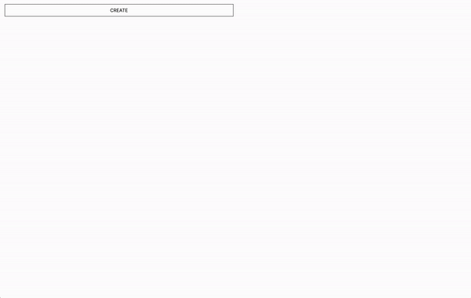

# next-replicate

Seamlessly integrate Replicate into your Next.js application.




## How to use

1. Wrap Your Application with the Provider

```tsx
export default function RootLayout({
  children,
}: {
  children: React.ReactNode;
}) {
  return (
    <html lang="en">
      <ReplicateProvider>
        <body className={inter.className}>{children}</body>
      </ReplicateProvider>
    </html>
  );
}
```

2. Use the hook

```tsx
import React from "react";
import { useReplicate } from "@/lib/client/use-replicate";

const ReplicateComponent: React.FC = () => {
  const { addRequest } = useReplicate();

  return (
    <button
      onClick={() => {
        addRequest({
          prompt: "photo of the earth taken from the moon, cinematic, dramatic",
          version:
            "c221b2b8ef527988fb59bf24a8b97c4561f1c671f73bd389f866bfb27c061316",
        });
      }}
    >
      Generate
    </button>
  );
};

export default ReplicateComponent;
```

3. Setup API Routes

- Create `api/replicate/[[...id]]` folder
- Create route.ts
- Paste the following code

```ts
import { handlers } from "@/lib/server/replicate";
export const { GET, POST } = handlers;
```

4. Setup .env

```
REPLICATE_API_TOKEN=YOUR_TOKEN_HERE
```

## Hook API

- **addRequest(input: any, version: string)**

This function allows you to add a request to the queue. The `input` takes any parameters the current model you're using takes -- defer to Replicate for documentation. `version` is simply the model version you're using.

- **requests**

This object contains all the pending and processed predictions. Accessible in all the children components and pages wrapped by the provider.